

  

  # ExplainMyReports

  **Turn medical documents into plain-English summaries — solo-built, HIPAA-aligned, AWS serverless.**

  [Live preview](https://explainmyreports.com) · [App (dev)](https://dev.explainmyreports.com)

> **About this repo.** The application source is private. This page is a curated portfolio overview — the architecture, the engineering decisions, and a tour of the UI. If you're hiring and want to see code, reach out at `bryson2809@gmail.com` and we can talk.

---

## What it is

Patients get medical reports they can't read. Insurance summaries. MRI findings. Lab panels. The text is technical, the layout is hostile, and the few sentences that matter are buried.

ExplainMyReports takes any PDF, scan, or image of a medical document and returns:
- A **plain-English summary** with severity rating
- An **AI-generated anatomical diagram** illustrating the affected area
- **Questions to bring to your doctor** at the next visit

It's not medical advice. It's a translation layer so patients walk into appointments better prepared.

  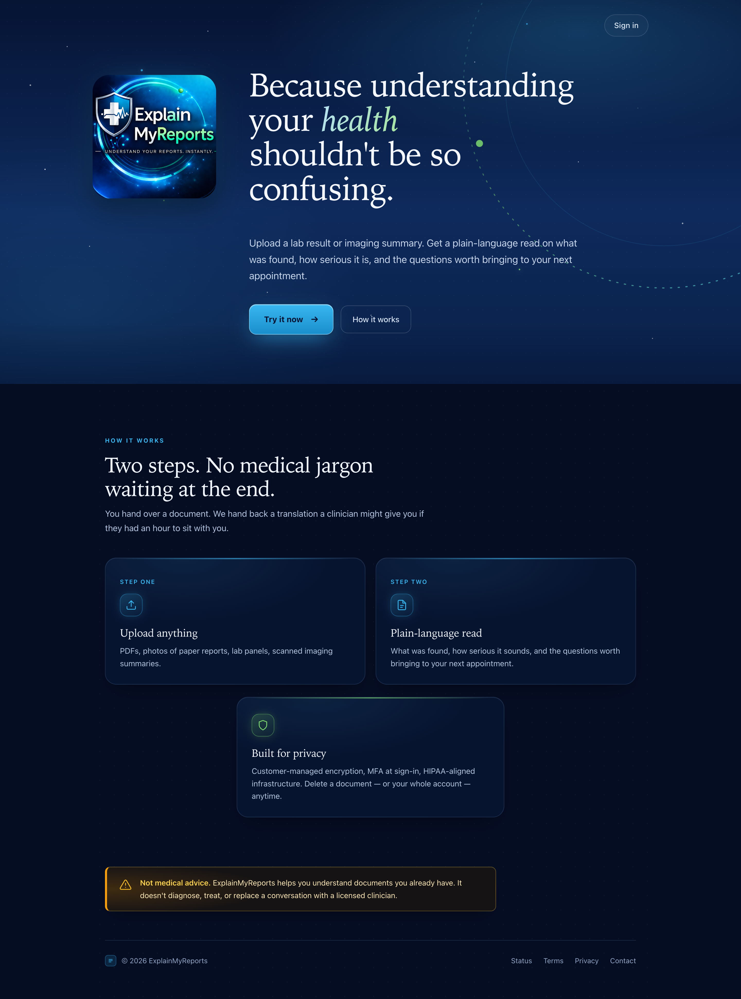

---

## Architecture

End-to-end serverless on AWS. One developer, one production-ready stack.

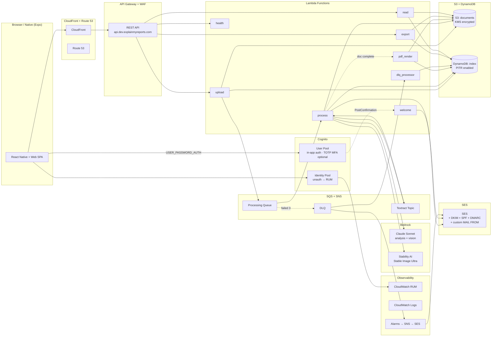

### Document processing pipeline

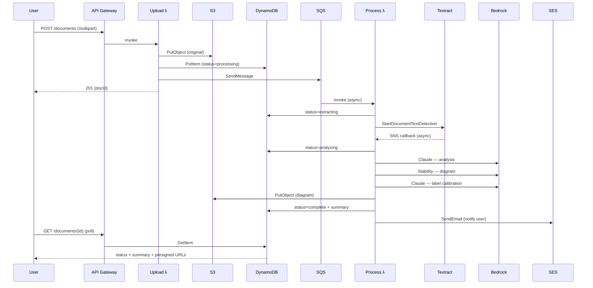

### Auth flow

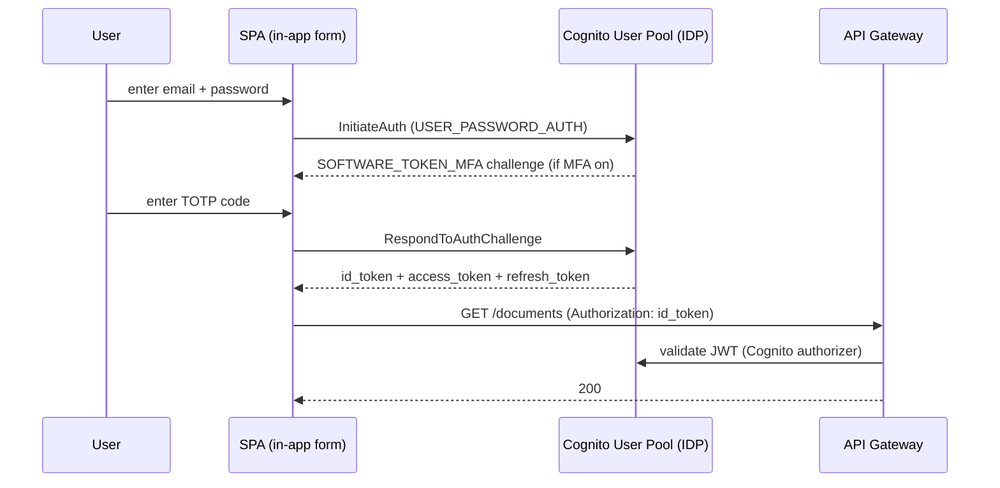

---

## Engineering decisions worth talking about

### 1. HIPAA without the HIPAA tax
Everything that touches PHI runs under AWS's BAA: Cognito, Lambda, S3, DynamoDB, SQS, SNS, Bedrock (Anthropic + Stability), Textract, SES, CloudWatch (including RUM). Customer-managed KMS key encrypts everything at rest — bucket, table, queue, log group. Cognito with optional self-service TOTP MFA, CloudTrail with 90-day retention, WAF in front of API Gateway.

The non-obvious move: **CloudWatch RUM instead of Sentry**. Most real-user-monitoring vendors require an enterprise contract for HIPAA-eligible BAA coverage; RUM is BAA-covered by default and the client SDK supports URL coarsening to keep PHI proxies (document UUIDs in path params) out of the event stream. Trade smaller feature set for zero additional BAA paperwork.

### 2. The two-call vision pipeline
The diagram needs labels (numbered callouts pointing at anatomical features) that match the user's specific findings. Naive approach: have one model generate both image + labels. That fails — the image generator doesn't know what it drew at pixel-level precision.

Actual approach:
1. **Claude generates** a structured analysis with a `🧠 VISUAL DIAGRAM DESCRIPTION` line (one prose sentence for the image model) and a `📍 LABELS` section (short labels paired with anatomical references).
2. **Stability generates** the image from the description.
3. **Claude (vision)** receives the generated image and the labels, and returns `{x, y}` percentages for each label.

The third call only runs after the image exists. If it fails (rate limit, transient error), the document still ships with diagram + image_description + zero labels rather than blocking on the visual pass.

### 3. DLQ race condition
SQS retries the processing message 3× before sending it to the DLQ. A dedicated `dlq_processor` Lambda catches DLQ messages and marks the corresponding DDB row `status=failed` so the user's polling UI flips to the retry button instead of spinning forever.

**The race**: a slow-but-eventually-successful processing run can complete *after* the DLQ message lands. Without a guard, the DLQ processor would clobber a successful `status=complete` back to `failed`.

**The guard**: every DDB update from the DLQ processor uses a `ConditionExpression: #s <> :complete`. If the doc finished first, the update no-ops and the user sees their successful summary.

### 4. Email deliverability is half DNS, half headers
Cognito + AWS SES + custom domain is the easy part. Getting to inbox instead of spam took five separate things:
- **DKIM** CNAMEs from SES auto-set up
- **SPF** TXT at apex (`v=spf1 include:amazonses.com -all`)
- **DMARC** at `_dmarc` (monitor mode, `p=none; aspf=r; adkim=r`) — Gmail weights *presence* of DMARC even at p=none
- **Custom MAIL FROM domain** at `bounce.explainmyreports.com` with its own SPF + MX so the envelope-from and From: header domains align (without this, SPF passes but DMARC's SPF half fails because of misalignment)
- **Display-name From header** (`"ExplainMyReports" <noreply@…>`) and **Reply-To** (`support@…`)

First-email-after-DKIM landed in spam. Second one, after these landed, hit inbox.

### 5. Lambda packaging: build dir vs source
Terraform's `archive_file` zips a directory. The directory has to be populated before `terraform apply` or it ships stale code. There's no warning — the plan shows a hash change, but doesn't tell you the *content* is six versions behind.

The fix is a `lambdas/build.sh` script that wipes and repopulates `lambdas/build/<name>/` with the current source + pinned wheels (`--platform manylinux2014_x86_64 --python-version 3.12 --only-binary=:all:`). The hash drifts only when source or deps actually change. Bit me once before I figured it out — wrote it up so future-me wouldn't repeat the mistake.

### 6. Account export: JSON → ZIP → PDF → page-faithful PDF
v1: JSON dump of metadata + presigned URLs. Technically correct, useless to a non-developer.

v2: zip with per-doc folders, but the summary was a markdown file and the diagram was a separate PNG.

v3: zip with one unified PDF per doc, hand-built with `fpdf2`. Universal to open, but the layout was a reconstruction — it never quite matched what the user saw on the detail page.

v4 (shipped): a dedicated `pdf-render` Lambda renders each summary PDF from the *same* HTML/CSS as the website's detail page using **headless Chromium via Playwright**, so the export looks like the real page rather than a re-drawn approximation. Rendering is idempotent (keyed on a canonical S3 key) and triggered two ways: by SNS the moment a doc completes, or synchronously from the read Lambda for older docs that predate the feature. The export Lambda then zips the per-doc PDFs.

Cost works out to ~$0.005 per typical 50 MB export (dominated by S3 → internet egress at $0.09/GB). Storage is bounded by a 1-day lifecycle rule on the `exports/` S3 prefix.

---

## What's shipped (so far)

| Surface | Highlights |
|---|---|
| **Marketing site** | Static HTML at the apex; brand-matched, 88 px logo header, Terms + Privacy footer |
| **Auth** | Cognito User Pool, custom in-app sign-in / sign-up / confirm / reset flow via direct IDP calls (USER_PASSWORD_AUTH — no hosted UI), optional TOTP MFA, verify-before-update on email, welcome email on sign-up |
| **Upload** | PDF / image / SVG, XHR-with-onprogress (fetch can't surface upload progress), 10 MB cap, WAF in front |
| **Processing** | Async via SQS, Textract OCR for scans, Bedrock Claude for analysis, Bedrock Stability (Stable Image Ultra) for diagram, two-call vision for label calibration |
| **Document UX** | Status polling, severity banner, AI-section markdown rendering, label callouts on the diagram, "longer than usual" hint after 2 minutes |
| **Failure recovery** | DLQ processor flips stuck rows to `failed`, in-app retry button re-enqueues the SQS message, SNS-driven email alert to the operator |
| **Settings** | Change password, change email (2-step verification), enable / disable TOTP MFA, delete account (wipes S3 + DDB + Cognito), download all data (ZIP of per-doc PDFs) |
| **Onboarding** | 3-step consent gate (welcome → privacy promise → terms acceptance), versioned acceptance so material terms changes re-prompt |
| **Legal** | /terms and /privacy public routes, versioned and effective-dated; consent gate re-prompts on a terms-version bump |
| **Observability** | CloudWatch RUM (client errors + page-load + http), CloudWatch dashboard (queue depth, lambda errors, API 4xx/5xx, DDB throttles), SNS-fanned DLQ alarm, public `/health` endpoint behind a status page |
| **Email** | SES with DKIM + SPF + DMARC + custom MAIL FROM; welcome email on sign-up (Cognito PostConfirmation), completion notifications, alert subscriptions |
| **Tests** | 132 pytest cases with moto for AWS service mocking and unittest.mock for Textract + Bedrock; GitHub Actions runs pytest + `tsc` + `terraform validate` as the merge gate |
| **Infra** | Terraform with remote S3 state + DynamoDB lock table; 8 modules (auth, api, frontend, landing, processing, storage, monitoring, notifications); dev + prod environments |

---

## UI tour

### Marketing landing

Branded apex domain. The logo image was extracted from the user's design, alpha-threshold-trimmed to remove anti-aliased edge pixels that were rendering as awkward whitespace, then squared with minimal padding.

### In-app sign-in

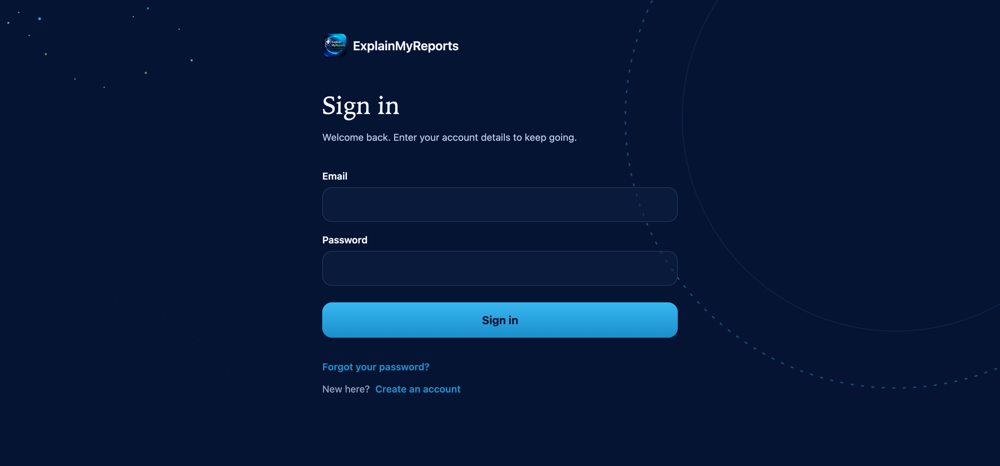

A custom sign-in surface rendered by the SPA. Sign-in, sign-up, email confirmation, MFA challenge, and forgot/reset password are all hand-rolled against the Cognito IDP (USER_PASSWORD_AUTH), so the UI can branch on Cognito error codes — e.g. auto-resend the verification code on `UserNotConfirmedException` instead of dead-ending. This replaced the earlier Cognito Hosted UI + OAuth-code-grant flow.

### App landing (signed-out)

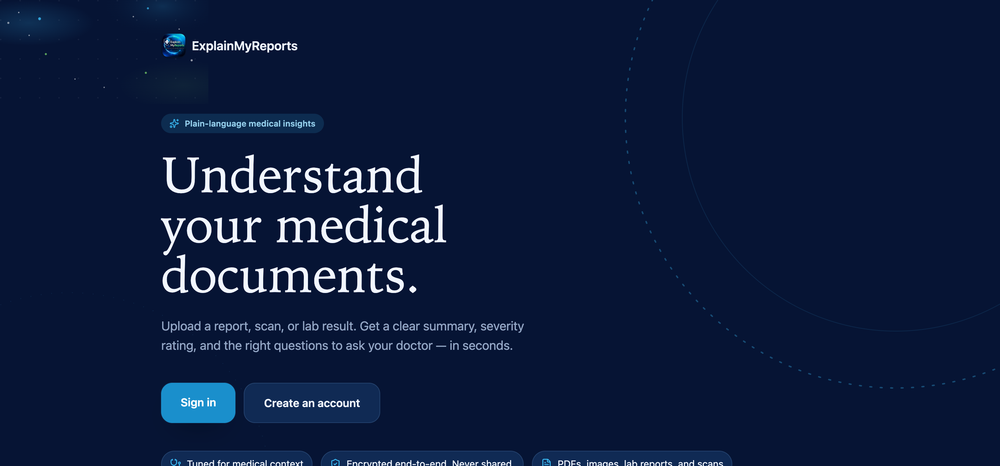

The React Native + Web version of the landing, rendered from the same codebase that powers the native app target.

### Legal pages

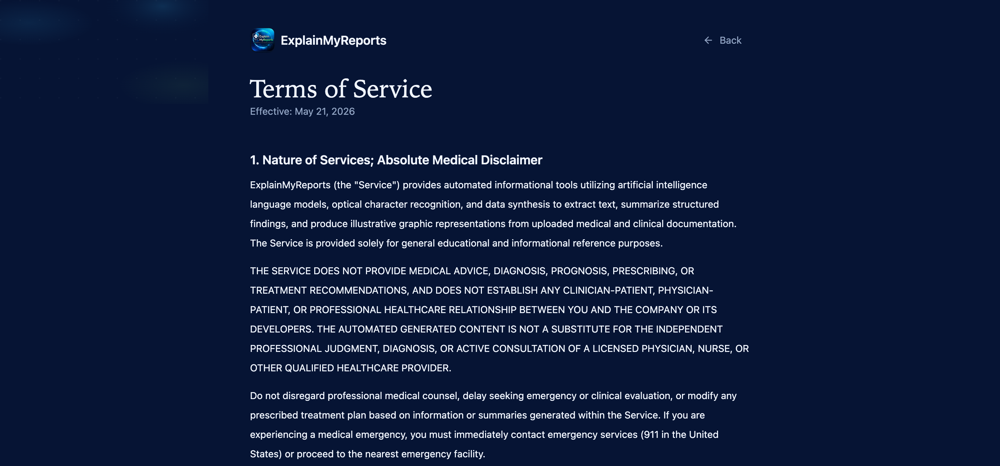

Public `/terms` and `/privacy`, versioned and effective-dated. The routing, content, and consent-gate plumbing are wired to the published terms version, so a material change re-prompts every user on next sign-in.

### Onboarding consent gate

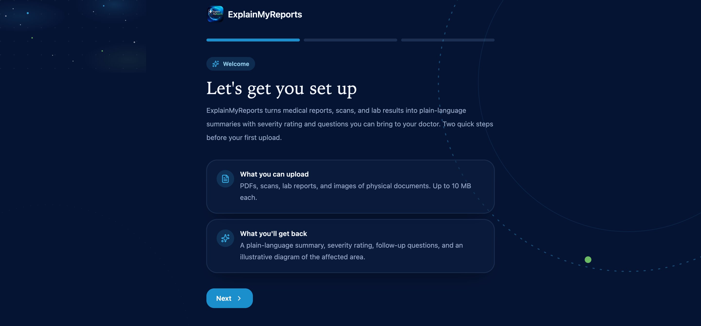

Three steps on first sign-in: welcome → privacy promise → terms acceptance. Acceptance is versioned (`TERMS_VERSION = "v1-2026-05-18"`); bumping it re-prompts every user. Signing out clears the local record so a different user on the same device gets prompted.

### Dashboard

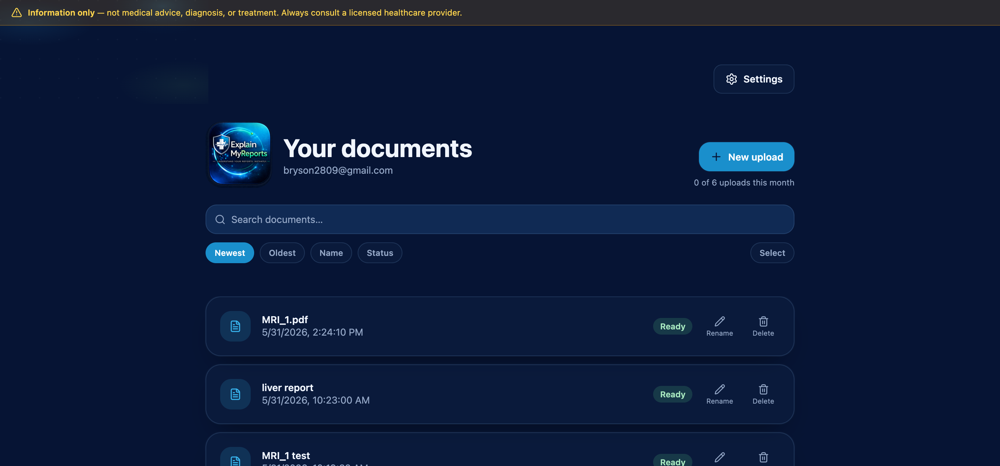

Document list with status badges. Polling refreshes every 3 s for any doc that isn't in a terminal state. Pull-to-refresh on touch devices. Optimistic delete with rollback on error.

### Document detail

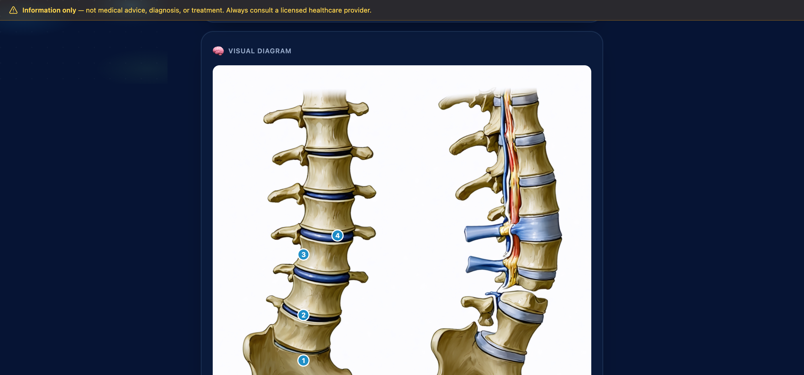

*Synthetic medical report — no real patient, provider, or examination.*

The signature surface: an AI-generated anatomical diagram with numbered callouts positioned over the image at percentage-coordinates calibrated by a separate Claude vision pass. The full page also carries a 1–6 severity scale with a generated explanation of why the level was chosen, emoji + ALL-CAPS section headers pulled straight from Sonnet's structured output, and a numbered list of questions to bring to the doctor.

### Settings

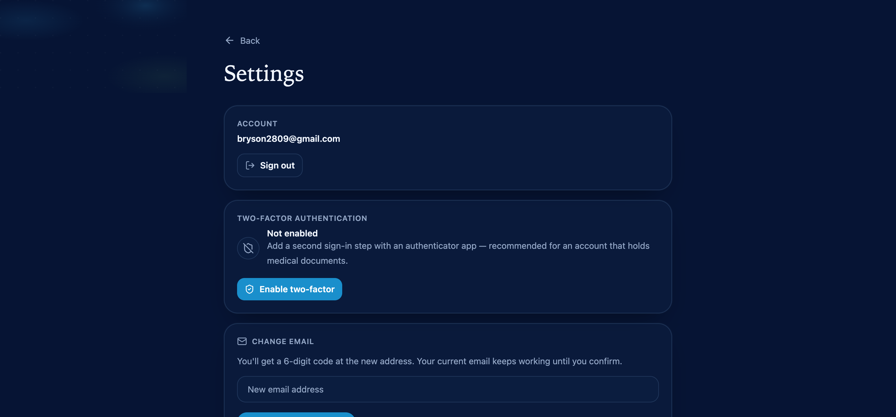

Account email (read-only), two-factor authentication (enable or disable TOTP), 2-step email change, password change, links to legal pages, data export (downloads a ZIP of per-doc PDFs), delete account (wipes S3 + DDB + Cognito).

---

## Tech stack at a glance

**Languages** — Python 3.12 (Lambda), TypeScript (frontend), Bash (deploy scripts), HCL (Terraform)

**Frontend** — Expo (React Native + Web), React 19, Expo Router, NativeWind v4 (Tailwind on RN), TanStack Query, hand-rolled Cognito IDP auth (USER_PASSWORD_AUTH), expo-secure-store, react-native-svg, aws-rum-web

**Backend** — AWS Lambda (Python), boto3, pypdf; headless Chromium via Playwright for page-faithful PDF rendering

**AI** — AWS Bedrock: Claude Sonnet 4.6 via cross-region inference profile (analysis + vision), Stability Stable Image Ultra (text-to-image diagram)

**Infrastructure** — Terraform with remote state, AWS Cognito, API Gateway (REST + Cognito authorizer + WAF), CloudFront, Route 53, ACM, KMS, S3 (KMS, versioning, lifecycle, OAC), DynamoDB (KMS, PITR, GSI, Streams), SQS (with DLQ), SNS, SES (DKIM + SPF + DMARC + custom MAIL FROM), Textract, Bedrock, CloudWatch (Logs, Dashboard, Alarms, RUM), CloudTrail

**Testing** — pytest, moto, unittest.mock — 132 unit tests covering Lambdas including cross-user isolation, race conditions, malformed input handling; GitHub Actions CI (pytest + `tsc --noEmit` + `terraform validate`) gates every merge

**Tooling** — gh CLI for PR workflow, git worktrees (main checked out separately for clean reference), Chrome DevTools MCP for in-loop UI verification

---

## A note on shipping pace

This was built solo, with frequent merges to keep the dev environment representative. From the first AWS commit to the current feature-complete state, **86 PRs** landed — most under an hour from branch to merge, each with tests and a clean test plan, gated by CI. Examples worth reading:

- `feat(notifications): SES completion email on processing complete` — the one with the SES sandbox + IAM scoping that taught me about envelope-from alignment
- `feat(reliability): DLQ processor, retry endpoint, frontend retry button` — closes the silent-stuck-doc gap end-to-end
- `feat(monitoring): CloudWatch RUM for the web app` — picked over Sentry to stay inside the BAA, with PHI-safe URL coarsening
- `feat(account): self-service data export delivered as a ZIP` — JSON → folder zip → fpdf2 PDF → page-faithful PDF rendered by headless Chromium

---

## Contact

If you've made it this far and want to talk — **bryson2809@gmail.com**.
